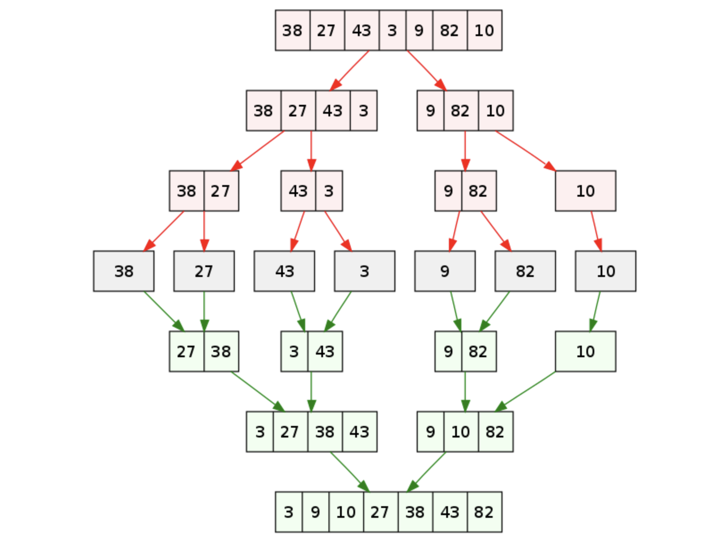

# Sort methods：

### Merge Sort (归并排序)
merge sort 的基本思想是把一个数组 ***分为两个子数组***，通过递归的方式重复切分子数组，直到只剩下一个元素。然后俩俩元素比较大小后合并起来，通过不停的合并子数组，最后得到排好序的数组。是 divide and conquer 算法的一种应用。如下图[1]：

merge sort 的时间复杂度为 O(nlogN), 空间复杂度为 O(N)。

### References
1. 图灵星球TuringPlanet： https://turingplanet.org/2020/02/11/排序算法【数据结构和算法3】/#gui_bing_pai_xu_MergeSort