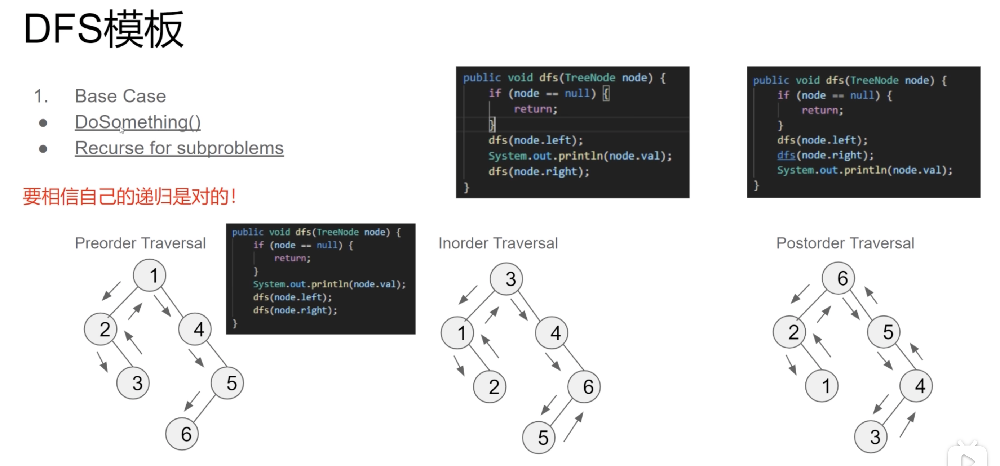

# dfs & bfs & union found：
这三种方法广泛使用在树和图中，但是并不仅限于如此。
### BFS (Breadth-First-Search) in Tree
根据由易到难的原则，我们先讲宽度优先搜索在 tree 中的应用。所以首先大概复习一下 tree 的基本概念。
**Tree：**
Tree 和 Linked List的概念类似，都是将数据不一定连续的储存在内存中，并由节点的 reference 串联起来。Tree 是一种递归结构（所以很多树的题目可以使用递归解决），可以看成一种特殊的无环无向图。***并且每棵树只能有一个 root。***
遇到的题目中大部分都是 Binary Tree，这是一种最简单也最常见的树。***二叉树是指每个节点最多只有两个分支的树。*** 换句话说，就是<font color=red>一棵树要么是空的，要么有两个指针，并且每个指针指向一棵树</font>。
复习完 Tree，接下来看一下 BFS 如何在 Tree 中使用的。

**BFS：**
宽度优先搜索算法在树结构里是按照层的概念从 root 开始一层一层向下搜索的算法，所以比较适合处理和层数（level）相关的题目。
因为 BFS 按照从上到下，从左到右的顺序进行搜索，所以我们需要 ***使用 Queue 来记录需要被展开的节点。***
**Step of BFS in Tree：**
* 起手初始化一个队列（queue）储存所有的入口节点（根据队列的特性，先进入队列的也先离开队列，然后记录离开的节点的子节点到队尾）；
* while循环遍历队列（queue），循环条件为队列不为空；
  * for each node in the queue **(currently)**
  * poll out the element (add to result)
  * expand it, offer children to the queue in order
  * increase level
BFS 因为是一层一层展开，所以对内存不友好。时间复杂度为O（n）。

**DFS：**
相较于 BFS，深度优先搜索更偏向于垂直搜索，即得到一个新节点时立即对新节点进行遍历。（例：从 root 出发，获得左子节点后立即获取左子节点的左子节点。直到没有新子节点了，则返回父节点，然后搜索右节点。）DFS 的空间复杂度是和高度相关的，所以比 BFS 友好一些。时间复杂度为O（n）。
不同于 BFS，深度优先搜索算法讲究先进后出（First in Last out），所以 ***使用 Stack 来记录需要被展开的节点。***
**Step of DFS in Tree：**
DFS 使用递归的方式搜索
1. Base case
2. 数据操作
3. 子问题递归

步骤二和步骤三的顺序不一定，因为树有三种遍历方式：pre-order，in-order，post-order。二三步的具体顺序看使用哪种遍历方式而定，如下图[1]：


**DFS的变种：**
1. Top-Down DFS：
  * 把值通过参数的形式从上往下传递
  * 一般dfs()本身不返回值（因为需要操作的值从上面传下来）
  
2. Bottom-Up DFS（常见）：
  * 把子问题的值从下往上传递
  * 当前递归层获取子问题传上来的值进行操作，得到新值并返回
  * 一定有返回值

### LeetCode 原题
* [102. Binary Tree Level Order Traversal](https://leetcode.com/problems/binary-tree-level-order-traversal/)
```Java
public List<List<Integer>> levelOrder(TreeNode root) {
  List<List<Integer>> result = new ArrayList<>();
  if(root == null) {
      return result;
  }
  // 起手一个queue
  Queue<TreeNode> queue = new LinkedList<>();
  // 存储所有入口（树结构只有一个root）
  queue.offer(root);
  while(!queue.isEmpty()) {
      // 获取当前层有几个node
      int size = queue.size();
      List<Integer> level = new ArrayList<>();
      // 展开当前层的所有节点
      for(int i = 0; i < size; i++) {
          TreeNode curr = queue.poll();
          level.add(curr.val);
          if(curr.left != null) {
              queue.offer(curr.left);
          }
          if(curr.right != null) {
              queue.offer(curr.right);
          }
      }
      result.add(level);
  }
  return result;
}
```

* [104. Maximum Depth of Binary Tree](https://leetcode.com/problems/maximum-depth-of-binary-tree/description/)
```Java
public int maxDepth(TreeNode root) {
  // bottom-up DFS 基本示例
  // 第一步：base case
  if(root == null) return 0;
  // 第二步：子问题递归并获取结果
  int leftNodes = maxDepth(root.left);
  int rightNodes = maxDepth(root.right);
  // bottom-up 一定要返回值
  return Math.max(leftNodes, rightNodes) + 1;
}
```

### References
1. 图灵星球TuringPlanet： https://www.bilibili.com/video/BV1xT4y1E7TD/?spm_id_from=333.999.0.0&vd_source=4faf10beb658f7c52556c5ce586b3fa2
